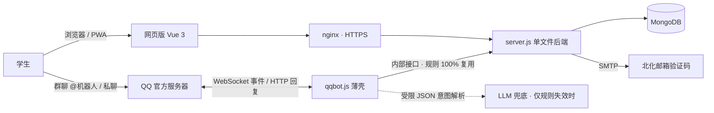

<div align="center">


**不再一个人出发**

[](https://bhtx.prom1se.cn)
[](https://nodejs.org)
[](https://vuejs.org)
[](https://www.mongodb.com)


**北化校友共建的拼车平台。**

[网页版](https://bhtx.prom1se.cn) · [QQ 机器人](#-qq-机器人) · [数据看板](https://bhtx.prom1se.cn/dashboard)

</div>

---

小程序时代：**1900+ 用户、100+ 次真实拼成**。小程序停止服务后，整个系统以 **网页 + QQ 官方机器人** 的形态重建——发布行程从填表变成说一句话。

## ✨ 它解决什么

校园拼车最难的不是找车，是**开口**。百花同行把流程压到最短：

1. 群里发一句「明天下午四点 北化北区到北京南站」—— 行程就挂上了
2. 同路同学看到行程号，一句「加入 260914001」—— 上车
3. 加入后互看联系方式，出发前 1 小时机器人私聊提醒 —— 碰头
4. 任意成员填一下实际车费，行程完成时人均自动算好、通知每个人 —— 分摊

## 🌟 核心特色

- **说句话就能发布**：中文时间、地点关键词、口语查询全部由规则引擎解析；仅当规则完全失效时才调用免费 LLM 辅助理解，它只输出受限 JSON 意图，代码复核后走与网页完全相同的流程。用户看到的内容永远由代码生成
- **私聊可用，不必进群**：发布、查询、加入、退出、取消、填车费在 QQ 私聊中即可完成，几乎全部功能不依赖任何群；群承担广播层——加入退出通知、每日四档行程播报
- **快捷入口内置**：单聊底部设有常用按钮与指令面板，点按自动填入指令；机器人和群的二维码、号码同时展示在站内专页
- **行程号直达操作**：`YYMMDD + 当天第几班`（如 `260914001`），一经分配不变；凭 9 位号或会话序号即可加入 / 退出 / 取消 / 填车费，不依赖聊天上下文
- **同路推荐**：发布瞬间匹配「到达地点相近 + 1 小时内出发」的进行中行程，把重复发车变成拼上已有车
- **车费自动 AA**：任意成员填写实际总费，行程结束后人均自动计算并逐一通知；未填写按路线预估区间计入统计
- **统一容量口径**：按乘客数计（司机不计人），全站人数统一 `x/y 人`（x 含发起者）
- **单一规则实现**：网页与机器人共用同一后端——机器人以用户身份凭证自调用公开接口，限流、防超卖、脱敏天然一致
- **不经手任何资金**：平台只做信息撮合，费用线下分摊，完全免费

## 🗣 QQ 机器人

群内 @机器人 或私聊直接发送，同一套指令：

| 你说 | 机器人做 |
|---|---|
| 明天下午四点 北化北区到北京南站 | 解析并创建行程，发布后推荐同路行程 |
| 查 明天 / 明天早上去机场的有吗 | 列出班次、余位与行程号 |
| 加入 行程号 / 加入 序号 | 上车（须已登记联系方式） |
| 退出 行程号 / 退出 | 下车（列出你的行程供选择） |
| 我的 | 进行中的行程；私聊附同行人联系方式 |
| 完成 行程号 / 取消 行程号或序号 | 发起人结束行程，成员收通知 |
| 车费 行程号 金额 | 任意成员填写实际车费 |
| 通知 行程号 / 播报 | 提醒同车成员 / 播报我的行程到全部群 |
| 私聊 绑定 学号 · 联系方式 · 解除绑定 | 身份与联系信息管理（拒绝在群内执行） |

## 🖥 网页端

单页应用：同行大厅、发布、我的行程、详情与成员列表、教程与协议。手机浏览器「添加到主屏幕」（PWA）后与原生应用无异；大厅无需登录即可浏览，加入与联系方式互看需北化邮箱认证。地点支持库外自定义输入，常用地点与别名维护在明文配置文件中，保存即热更新。

## 🔔 全自动提醒

- 加入 / 退出 / 取消 → 私聊通知行程全体其他成员
- 出发前约 1 小时 → 私聊提醒全车成员
- 每日 9 / 12 / 15 / 18 点 → 群内播报当日待出行程
- 行程完成且已填车费 → 人均结算通知全员

## 📊 数据看板与管理界面

- **数据看板** [`/dashboard`](https://bhtx.prom1se.cn/dashboard)：转化漏斗、按日趋势、撮合健康度（被加入占比、平均成行时长）、车费统计
- **管理界面** [`/manage`](https://bhtx.prom1se.cn/manage)：共建者名录、赞助收款码、赞助申请审核、QQ 频道（机器人与多个群的号及二维码）

<div align="center"></div>

## 🛠 技术栈与架构

零构建前端（Vue 3 单页）+ 单文件后端（Node 20 / Express / Mongoose）+ QQ 官方机器人（WebSocket 长连接 + 规则解析 + LLM 兜底）。



## 🚀 快速开始

```bash
git clone https://github.com/Prom1seCN/BHTXwebot.git
cd BHTXwebot
npm install
cp .env.example .env   # 填 JWT_SECRET / SMTP_PASS / ADMIN_KEY / QQ_BOT_* / LLM_API_KEY
node --env-file=.env server.js
```

仅预览前端（无需 MongoDB）：`node dev-preview.js` → http://localhost:3001

## 📦 部署

腾讯云轻量 Ubuntu 22.04，pm2 管理两个进程，**必须 fork 模式**（cluster 不传 `node_args`，`--env-file` 会静默失效）：

| 应用 | 说明 |
|---|---|
| `bhtxweb` | server.js，静态托管 + `/api/*`，端口 3100 |
| `bhtx-qqbot` | qqbot.js，WebSocket 接入 QQ 官方机器人 |

数据库每 12 小时自动备份，备份后执行恢复演练。发布：`python tools/deploy.py <密码> upload && python tools/deploy.py <密码> start`

## 🛡 安全与隐私

- 教育邮箱验证保证校内身份；邮箱不予公开，日志与界面均脱敏
- 联系方式仅同车成员互见；加入行程强制登记联系方式
- 学号、联系方式不进入群聊天记录（机器人强制引导私聊）
- 后台与管理接口全部 ADMIN_KEY 鉴权（密钥仅经 header 传递）；内部接口额外要求本机回环来源，公网与浏览器一律 403
- 行为埋点匿名统计、90 天自动过期；站内提供完整的[隐私政策](https://bhtx.prom1se.cn/#/legal)

---

<div align="center">

**Prom1seCN** · [prom1se.cn](https://prom1se.cn) · 浙ICP备2026023301号

</div>
