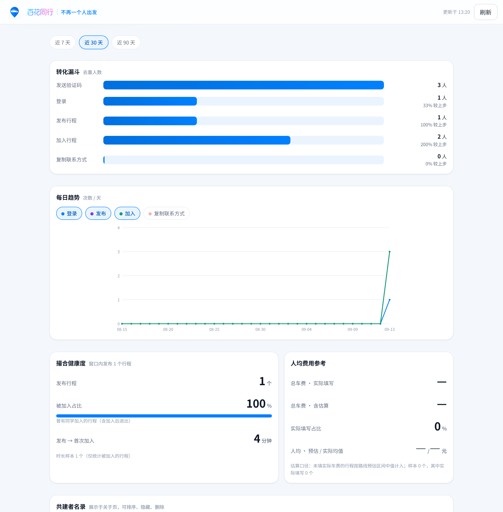
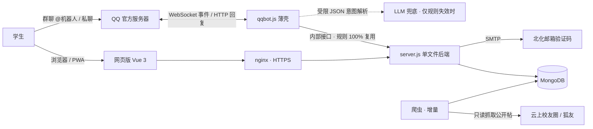

<div align="center">


**北化校友共建的拼车平台。**

撮合同行校友，平摊费用。

[](https://bhtx.prom1se.cn)
[](https://nodejs.org)
[](https://expressjs.com)
[](https://vuejs.org)
[](https://www.mongodb.com)
[](https://nginx.org)
[](https://web.dev/progressive-web-apps/)
[](https://developer.mozilla.org/docs/Web/API/WebSockets_API)

[网页版](https://bhtx.prom1se.cn) · [QQ 机器人](#-qq-机器人) · [数据看板](https://bhtx.prom1se.cn/dashboard)

</div>

---

已有 1900+ 同学使用，100+ 次真实拼成。

## 💬 怎么用

发布、加入、填写车费，均可通过一句话完成：

```
明天下午四点 北化北区到北京南站      发布行程
加入 260914001                      上车并互看联系方式
车费 260914001 60                   填写实际车费，人均自动结算
```

## ✨ 特色功能

- **自然语言发布** —— 支持「明天早上八点半去南站」「下午三四点去机场」等口语表达，无需按格式填表
- **QQ 机器人私聊操作** —— 发布、查询、加入、退出、取消、填写车费均可私聊机器人完成，群仅用于通知与播报
- **行程号直达** —— 格式为 `YYMMDD + 当日序号`，如 `260914001`，分配后不变。凭号即可操作，不依赖聊天上下文
- **同路推荐** —— 发布时自动匹配到达地点相近、出发时间相差 1 小时内的已有行程
- **车费自动 AA** —— 任意成员填写实际总费用，行程结束时自动计算人均并通知全员
- **不经手资金** —— 仅提供信息撮合，费用线下分摊，完全免费

## 📡 同行雷达

大厅同时展示校内论坛（云上校友圈、狐友）的公开拼车帖，与本站行程并列。

雷达内容不属于本站行程：不展示联系方式、不参与撮合，点击仅查看原帖与来源。即使本站暂无行程，大厅也不会空置。

- 增量抓取，出发时间已过的自动下架
- 由规则引擎判定是否为拼车帖（关键词 + 地点库 + 时间解析），不依赖模型
- 与本站行程视觉区分：绿色虚线边框，无「加入」按钮

## 🖥 使用方式

**网页版** [bhtx.prom1se.cn](https://bhtx.prom1se.cn)

包含同行大厅、发布、我的行程、详情与成员列表。手机浏览器「添加到主屏幕」后体验与原生应用一致。大厅无需登录即可浏览；加入行程与查看联系方式需通过北化邮箱认证。

**QQ 机器人 & QQ 群**

[bhtx.prom1se.cn/#/qq](https://bhtx.prom1se.cn/#/qq)

群内 @机器人 或私聊均可使用，指令一致：

| 你说 | 它做 |
|---|---|
| 明天下午四点 北化北区到北京南站 | 创建行程，并推荐同路 |
| 查 明天 / 明天早上去机场的有吗 | 列出班次、余位与行程号，附论坛公开帖 |
| 加入 行程号 / 加入 序号 | 上车（须已登记联系方式） |
| 我的 | 进行中的行程；私聊附同行人联系方式 |
| 车费 行程号 金额 | 填实际车费 |
| 完成 / 取消 / 退出 行程号 | 结束、撤销、下车 |

完整指令私聊发送「帮助」。

## 🔔 自动提醒

- 加入 / 退出 / 取消 → 私聊通知同车其他成员
- 出发前约 1 小时 → 私聊提醒全车成员
- 每天 9 / 12 / 15 / 18 点 → 群内播报当日行程
- 行程完成且已填写车费 → 人均结算通知全员

## 📊 数据看板

[`/dashboard`](https://bhtx.prom1se.cn/dashboard)：转化漏斗、按日趋势、撮合健康度、车费统计。每次发布和加入都有埋点记录。

<div align="center"></div>

## 🛠 技术

零构建前端（Vue 3 单页）+ 单文件后端（Node 20 / Express / Mongoose）+ QQ 官方机器人 + 增量爬虫。


```mermaid
flowchart LR
    U[学生] -->|浏览器 / PWA| W[网页版 Vue 3]
    U -->|群聊 @机器人 / 私聊| Q[QQ 官方服务器]
    Q <-- WebSocket 事件 / HTTP 回复 --> B[qqbot.js 薄壳]
    W --> N[nginx · HTTPS]
    N --> S[server.js 单文件后端]
    B -->|内部接口 · 规则 100% 复用| S
    S --> M[(MongoDB)]
    S -->|SMTP| E[北化邮箱验证码]
    B -.受限 JSON 意图解析.-> L[LLM 兜底 · 仅规则失效时]
    C[爬虫 · 增量] -->|只读抓取公开帖| F[云上校友圈 / 狐友]
    C --> M
```

网页端与机器人共用同一套后端：机器人以用户身份调用公开接口，因此限流、防超卖、数据脱敏保持一致。

## 🚀 本地跑起来

```bash
git clone https://github.com/Prom1seCN/BHTXwebot.git
cd BHTXwebot
npm install
cp .env.example .env
node --env-file=.env server.js
```

仅预览前端（无需数据库）：`node dev-preview.js` → http://localhost:3001

## 🛡 隐私

- 教育邮箱验证保证校内身份；邮箱不予公开，日志与界面均已脱敏
- 联系方式仅同车成员互相可见；加入行程须登记联系方式
- 学号与联系方式不进入群聊天记录（机器人强制引导至私聊）
- 后台与管理接口全部 ADMIN_KEY 鉴权；内部接口额外要求本机回环来源，公网一律 403
- 行为埋点匿名统计、90 天自动过期；[隐私政策](https://bhtx.prom1se.cn/#/legal)

## 🤝 共建

无需编程基础也可参与：向同学推荐（宣发）、反馈问题与建议（测试）、提交代码（技术共建）、提供素材（内容）。

所有参与者均会列入网页版的「共建者名录」。

---

<div align="center">

**Prom1seCN** · [prom1se.cn](https://prom1se.cn) · 浙ICP备2026023301号

</div>
